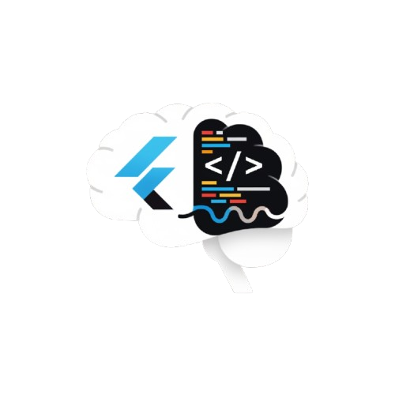

<div align="center">
  

  # **Quiz App Flutter 🚀**

  <p>
    Sebuah aplikasi kuis interaktif yang dibangun dengan Flutter untuk mendemonstrasikan konsep-konsep inti pengembangan aplikasi mobile. Proyek ini adalah eksplorasi belajar yang menyenangkan!
  </p>

  <p>
    
    
    
  </p>
</div>

---

### 🎬 **Demo Aplikasi**

Berikut adalah cuplikan singkat dari fungsionalitas utama aplikasi, mulai dari memulai kuis hingga melihat hasilnya.

<div align="center">
  
</div>

> **Catatan**: Anda perlu membuat file `app_demo.gif` Anda sendiri yang menunjukkan cara kerja aplikasi.

---

### ✨ **Fitur Unggulan**

-   🧠 **Kuis Dinamis**: Pertanyaan dan urutan jawaban diacak setiap kali permainan dimulai.
-   📊 **Skor & Ringkasan**: Laporan hasil yang detail, menunjukkan jawaban benar dan salah.
-   👤 **Halaman Profil Kustom**: Area untuk menampilkan identitas developer.
-   🔁 **Restart Cepat**: Mulai ulang kuis dengan sekali tekan tombol.
-   📱 **Desain Responsif**: Tampilan yang rapi di berbagai ukuran layar.

---

### 🛠️ **Instalasi & Penggunaan**

Siap untuk mencoba? Ikuti langkah-langkah mudah di bawah ini:

1.  **Clone Repositori**
    ```sh
    git clone [https://github.com/NAMA_USERNAME_ANDA/NAMA_REPOSITORI_ANDA.git](https://github.com/NAMA_USERNAME_ANDA/NAMA_REPOSITORI_ANDA.git)
    ```

2.  **Masuk ke Direktori Proyek**
    ```sh
    cd NAMA_REPOSITORI_ANDA
    ```

3.  **Instal Dependensi**
    ```sh
    flutter pub get
    ```

4.  **Jalankan Aplikasi!**
    ```sh
    flutter run
    ```

---

### 💡 **Konsep yang Dipelajari**

Proyek ini mencakup beberapa konsep penting dalam Flutter, antara lain:
-   **State Management**: Menggunakan `StatefulWidget` dan `setState` untuk mengelola UI yang dinamis.
-   **Navigasi**: Berpindah antar layar secara terprogram.
-   **Reusable Widgets**: Memecah UI menjadi komponen-komponen kecil yang dapat digunakan kembali (`AnswerButton`, `SummaryItem`).
-   **Layouting**: Menggunakan `Column`, `Row`, dan `Container` untuk membangun UI yang kompleks.
-   **Asset Management**: Memuat gambar dan font lokal ke dalam aplikasi.

---

<div align="center">
  <p>Dibuat dengan ❤️ untuk Praktikum Pemrograman Mobile</p>
</div>